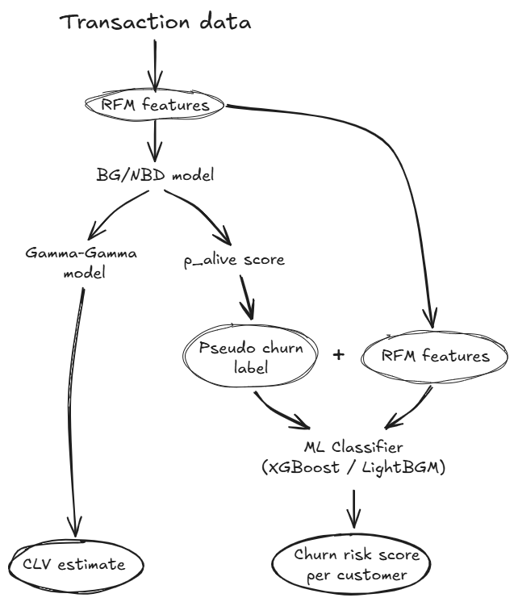

# Non-Contractual Customer Churn Prediction

> Predicting customer churn in non-contractual settings using a hybrid probabilistic + machine learning approach.

## Background

Customer churn in a marketplace or e-commerce setting is fundamentally different from churn in a subscription business. When a subscriber cancels, you know immediately. When a marketplace customer stops buying, there is no signal — they simply go quiet, and it is never clear whether they have churned or are just between purchases.

This makes standard churn models unusable out of the box: they require a labeled dataset of churned vs. non-churned customers, but in a non-contractual setting that label does not exist. Any attempt to define it with a fixed inactivity threshold (e.g. "no purchase in 90 days = churned") introduces arbitrary bias that the model then learns and perpetuates.

This project addresses that problem directly. Rather than forcing a binary churn label, we model the underlying purchase behavior probabilistically — asking *"what is the probability this customer is still active?"* instead of *"has this customer churned?"*

See [`docs/01_problem_framing.md`](docs/01_problem_framing.md) for a full discussion of the problem, why classical ML approaches fall short, and the business impact of getting this right.

This project applies the **Buy Till You Die (BTYD)** framework via the **BG/NBD** model, and extends it with a hybrid ML layer. Two complementary approaches are used:

1. **Pure probabilistic baseline** — BG/NBD + Gamma-Gamma models estimate the probability a customer is still "alive" (`p_alive`) and their expected Customer Lifetime Value (CLV)
2. **Hybrid extension** — BG/NBD-derived `p_alive` scores serve as pseudo-labels for a downstream ML classifier that incorporates richer behavioral features

See [`docs/03_conceptual_theory.md`](docs/03_conceptual_theory.md) for the theory behind the models.

## Dataset

[UCI Online Retail II](https://archive.ics.uci.edu/dataset/502/online+retail+ii) — ~1M transactions from a UK-based wholesale retailer (2009–2011).
After cleaning: **805,549 rows**, **5,789 unique customers**, date range `2010-01-01 → 2011-12-09`.

See [`data/README.md`](data/README.md) for download instructions and [`docs/02_dataset.md`](docs/02_dataset.md) for full data quality notes.

## Project Structure

```
├── data/                    # Raw and processed data (not committed)
├── notebooks/               # Analysis notebooks (run in order)
│   ├── 01_eda.ipynb
│   ├── 02_rfm_computation.ipynb
│   ├── 03_bgnbd_model.ipynb
│   ├── 04_hybrid_ml.ipynb
│   └── 05_comparison_report.ipynb
├── src/                     # Reusable Python modules
│   ├── preprocessing.py     # Data cleaning pipeline
│   ├── rfm.py               # RFM computation + calibration/holdout split
│   ├── probabilistic.py     # BG/NBD + Gamma-Gamma wrappers
│   ├── features.py          # Feature engineering for ML layer
│   └── evaluation.py        # Metrics, plots, comparison utilities
├── models/                  # Fitted model artifacts (.pkl)
├── reports/figures/         # Saved plots
└── docs/                    # Deep-dive documentation
```

## Quickstart

```bash
git clone https://github.com/farhanhl-ds/noncontractual-customer-churn-prediction.git
cd noncontractual-customer-churn-prediction
pip install -r requirements.txt
```

Download the dataset (see [`data/README.md`](data/README.md)), then run notebooks in order starting from `01_eda.ipynb`.

## Approach Overview

<picture>
  <source media="(prefers-color-scheme: dark)" srcset="images/flowchart_dark.png">
  
</picture>

## Documentation

| File | Description |
|------|-------------|
| [`docs/01_problem_framing.md`](docs/01_problem_framing.md) | Why non-contractual churn is hard and how we approach it |
| [`docs/02_dataset.md`](docs/02_dataset.md) | Dataset facts, data quality summary, RFM statistics |
| [`docs/03_conceptual_theory.md`](docs/03_conceptual_theory.md) | Theory behind BG/NBD, Gamma-Gamma, and the BTYD framework |
| [`docs/04_methodology.md`](docs/04_methodology.md) | How the models are applied end-to-end in this project |
| [`docs/05_results.md`](docs/05_results.md) | Key findings and model comparison *(to be updated)* |

## Tech Stack

| Layer | Library |
|-------|---------|
| Probabilistic modeling | `lifetimes`, `pymc-marketing` |
| ML modeling | `scikit-learn`, `xgboost`, `lightgbm` |
| Interpretability | `shap` |
| Data processing | `pandas`, `numpy` |
| Visualization | `matplotlib`, `seaborn` |

## Acknowledged Limitations

- The UCI Online Retail II dataset represents a **B2B wholesale** context with naturally higher and more regular repeat purchase rates than typical B2C marketplaces. Model generalizability to B2C settings should be validated on domain-specific data.
- BG/NBD assumes **stationary purchase behavior** — it does not capture trend or seasonality in transaction rates.
- Pseudo-labels generated by BG/NBD introduce **label noise** into the ML layer. Model performance is therefore sensitive to the quality of the probabilistic fit. See [`docs/03_conceptual_theory.md`](docs/03_conceptual_theory.md) for a detailed discussion of error propagation risk.

## Key Results

*To be updated after modeling phase — see [`docs/05_results.md`](docs/05_results.md).*

## References

- Fader, P.S., Hardie, B.G.S., & Lee, K.L. (2005). ["Counting Your Customers" the Easy Way: An Alternative to the Pareto/NBD Model](http://www.brucehardie.com/papers/018/fader_et_al_mksc_05.pdf)
- Fader, P.S. & Hardie, B.G.S. (2013). [The Gamma-Gamma Model of Monetary Value](http://www.brucehardie.com/notes/025/gamma_gamma.pdf)
- Hardie, B.G.S. (2014). [Notes on the BG/NBD Model](http://www.brucehardie.com/notes/004/bgnbd_spreadsheet_note.pdf)
- [`lifetimes`](https://github.com/CamDavidsonPilon/lifetimes) — Python library for CLV and non-contractual churn modeling
- [`pymc-marketing`](https://github.com/pymc-labs/pymc-marketing) — Bayesian marketing mix modeling and CLV estimation built on PyMC